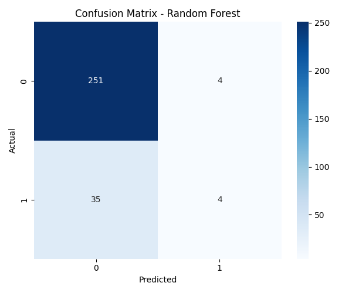
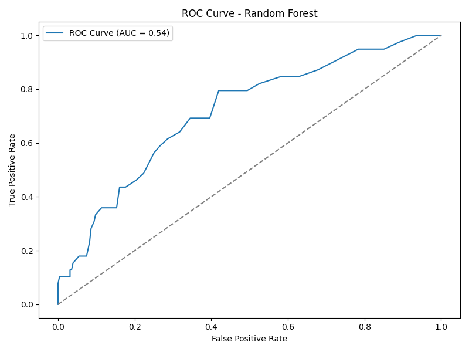

# 🧠 Employee Attrition Predictor

Predicts whether an employee is likely to leave the organization using HR data and classification models.

---

## 🚀 Quick Start

[](https://colab.research.google.com/drive/1b-ImmaTAH6b0M8szVfG9ulmHhdZ2-Mku?usp=sharing)

---

## 📂 Project Structure

```text
employee-attrition-predictor/
├── employee_attrition_predictor.ipynb    # Main notebook
├── employee_data.csv                     # Dataset
├── requirements.txt                      # Dependencies
├── README.md                             # Project documentation
└── plots/
    ├── confusion_matrix.png
    └── roc_curve.png
```

## 🧠 ML Stack

- **Models**: Logistic Regression, Random Forest Classifier
- **Metrics**: Accuracy, Precision, Recall, ROC-AUC
- **Libraries**:
  - scikit-learn
  - pandas
  - seaborn
  - matplotlib
  - numpy

---

## 📊 Key Features Used

- Age
- Job Role
- Department
- Monthly Income
- Job Satisfaction
- OverTime
- Years at Company
- Work-Life Balance
- Environment Satisfaction

---

## 🔬 Techniques Applied

- Data Cleaning & Label Encoding
- Exploratory Data Analysis (EDA)
- Train/Test Split
- ROC Curve & Confusion Matrix Visualization

---

## 📈 Sample Output

> 📍 Confusion Matrix – Random Forest  
> 

> 📍 ROC Curve – Random Forest  
> 

---

## 📦 Installation

```bash
pip install pandas numpy seaborn matplotlib scikit-learn
```
